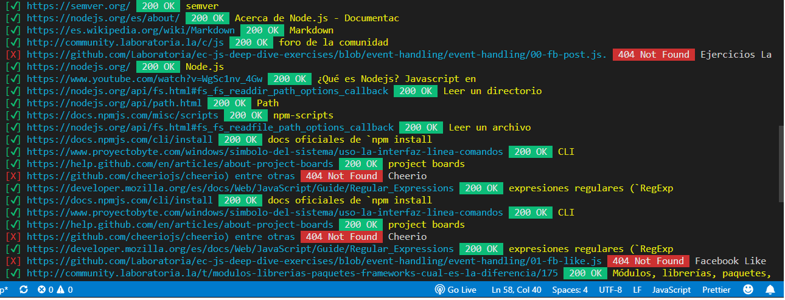
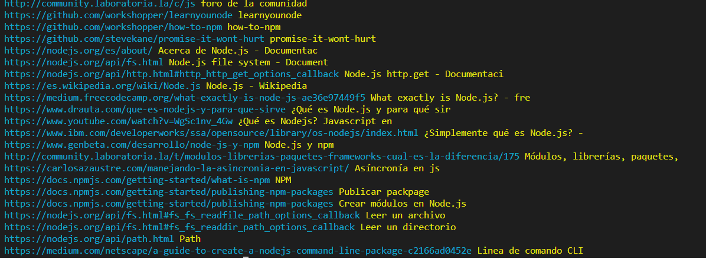
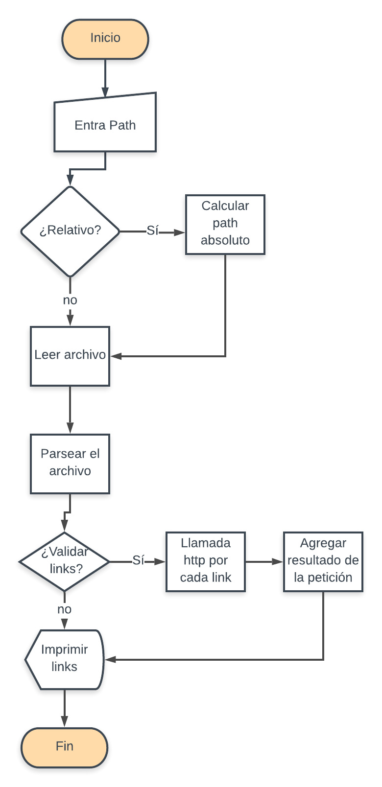

# Markdown Links

¿Que es Markdown Links? Es una libreria que sirve para extraer los links de tus archivos Markdown, hace la validación del estado de los enlaces encontrados lo cual permite conocer si un enlace existe o si esta roto asi como conocer su mensaje de error.

## Instalación

```
     npm install -g https://github.com/YolandaRib-4/GDL002-md-links
```


## ¿Como utilizar la librería?  - CLI

```
    mdLinks(path, options)
```

##### Argumentos

* **`path`** Nombre y extensión del archivo Markdown a analizar. Ejemplo: test.md
* **`options`**  Acepta los argumentos -v || --validate. El ingreso de este valor determinará si los links encontrados en el archivo Markdown serán validados o no. 

##### Ejemplo de uso

```
    mdLinks(test.md, --validate || -v)
```

## ¿Como se veran tus resultados en consola? 

##### Haciendo validación de los enlaces en tu archivo markdown




##### Analizando el archivo Markdown e imprimir los links encontrados




## Diagrama de flujo con el algoritmo que sigue la librería.

